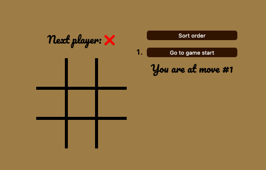
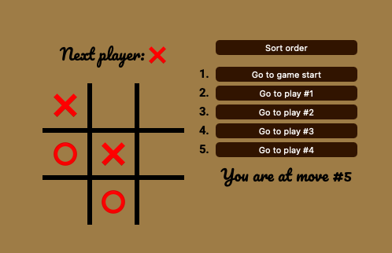
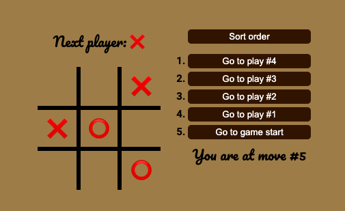
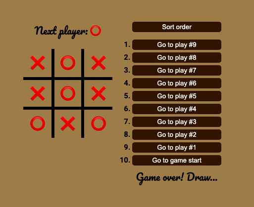

<h1>❌ Tic Tac Toe ⭕️</h1>
<h2>
This was a project from React.dev web page where we use React to build a Tic Tac Toe game.
</h2>

<h3>The Project</h3>

This project consists of a simple Tic Tac Toe game with the following funcionalities and characteristics:

<ul>
  <li>
    A board with 9 squares that the players can click on.
  </li>
  <li>
    A text on top of the board that informs the players who is next
  </li>
  <li>
    A list of buttons to go back to a specific play when clicked.
  </li>
  <li>
    A text at the end of the list with the current play number and when the game is over a congrulatory or a draw message.
  </li>
  <li>
  A button to sort the order of the list
  </li>
 </ul>

 

  The game has the following requirements:

<ul>
  <li>
    All board positions must be clickable and when clicked an X or O should apper in it according to whose turn it is.
  </li>
  <li>
    The value of a board position that is already filled can not change if the position is clicked again.
  </li>
  <li>
    If there is a winner, the players can not make any more moves.
  </li>
  <li>
    If and when a player is victorious, the winning positions should be highlighted.
  </li>
  <li>
    At each play, a button should be added to a list of buttons and each of these buttons should store the state of the board at the time it was created so the players can go back to any specific play.
  </li>
  <li>
    If a move is made after returning to a previous state of the board, the game should continue from that point.
  </li>
 </ul>

<h3>Technologies</h3>

<ol>
  <li>
  HTML
    <ul>
      <li>Class</li>
      <li>Id</li>
      <li>Google Fonts</li>
      <li>Buttons</li>
      <li>Ordered list</li>
    </ul>
  </li>

  <li>
  CSS
    <ul>
      <li>Display Flex</li>
      <li>Display Grid</li>
      <li>Class Selector</li>
      <li>Pseudo Selectors (hover effect)</li>
    </ul>
  </li>

  <li>
  JavaScript
    <ul>
      <li>Functions</li>
      <li>Arrow Functions</li>
      <li>Loops</li>
      <li>Conditionals</li>
      <li>Terciary Operatord</li>
    </ul>
  </li>

  <li>
  React
    <ul>
      <li>States</li>
      <li>Props</li>
      <li>Components</li>
    </ul>
  </li>
</ol>

  
  

  
  

  

